# Progetto PA & CVDL 23/24

<div align="center">
  <br/>
  
  <br/>
  <br/>
  <p>
    L'AI non è mai stata così semplice... Fino ad ora ! <br/>
    Microservizi per la gestione efficiente di un modello di Deep Learning.
  </p>
  <br/>
  <p>
    <a href="##Obiettivo"><strong>Obiettivo</strong></a> ·
    <a href="##Progettazione"><strong>Progettazione</strong></a> .
    <a href="##Rotte"><strong>Rotte</strong></a> .
    <a href="##API Docs"><strong>Api docs</strong></a> .
    <a href="##Startup"><strong>Startup</strong></a> .
    <a href="##Q &amp A"><strong>Api docs</strong></a> .
    <a href="##Autori e Contributi"><strong>Autori</strong></a> .
  </p>
  <br/>
</div>


## :dart: Obiettivo

L'obiettivo del progetto è quello di realizzare microservizi in _TypeScript_ allo scopo di interagire con [modelli di Deep-Learning](https://github.com/lucabellantee/Violence-Detection-for-edge-AI/edit/main/README.md) per il riconoscimento di scene di violenza in ambito edge. 


## Progettazione

### :electric_plug: Pattern Architetturale MVC 

Per il progetto è stato scelto di utilizzare il pattern **MVC**: "Model View Controller". Tale pattern è relativamente semplice da progettare ed implementare ma offre notevoli benifici in quanto scardina la comunicazione diretta tra la view, nel nostro caso le interazioni _http_ degli utenti, e il modello, ovvero il database. La struttura da noi progettata e implementata è quindi composta da: 

- **Model**: Logica di Business e accesso al database.
- **View**: Vista grazie alla quale l'utente si interfaccia con il software.
- **Controller**

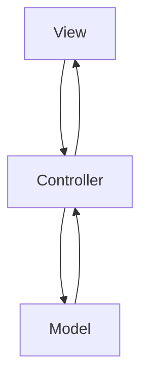

###  :whale: Architettura Docker 

L'infrastruttura `Docker` che si è implementata per realizzare il progetto e che prevede l'utilizzo di `docker-compose` per la sua gestione è la seguente:

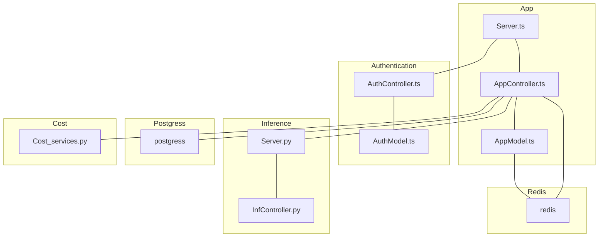

### Diagramma E-R

Per il progetto abbiamo deciso di utilizzare PostgreSQL, un database relazionale (RDBMS) open-source che supporta lo standard SQL, progettato per essere robusto e flessibile. Di seguito si riporta una rappresentazione dello schema del database tramite diagramma ER.

- `User`
- `Dataset`

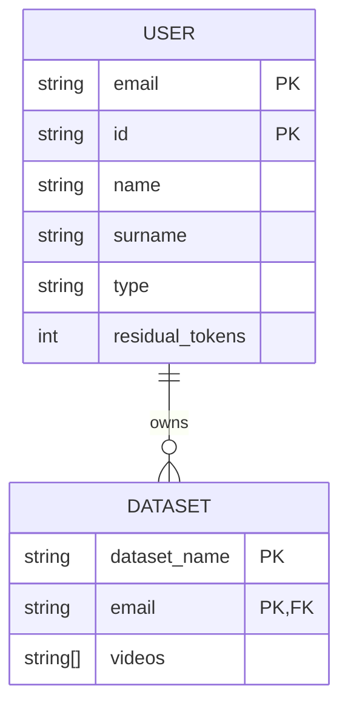
### Use Case
La figura sottostante rappresenta il diagramma dei casi d'uso. Per _generale_, si intende, un'operazione che può essere svolta a livello di qualsivoglia tupla della tabella: '_dataser_' oppure '_user_'.

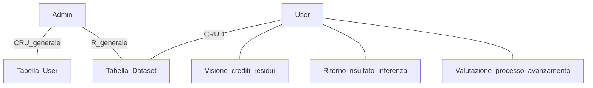


## Design Pattern

Breve descrizione dei design pattern utilizzati per la realizzazione del codice in TS. 

### Chain of Responsability

Il design pattern middleware è un concetto architetturale utilizzato principalmente nelle applicazioni web per gestire e processare le richieste e le risposte _HTTP_. Esso consente di strutturare il codice in moduli separati, ciascuno dei quali può eseguire una specifica operazione su una richiesta o risposta prima di passare al successivo middleware. Questo pattern è particolarmente comune nei framework web come Express. I prinicipali punti di forza sono i seguenti: 

- 'Modularità': Ogni funzionalità può essere separata in moduli distinti. Questo rende il codice più organizzato e manutenibile.
- 'Riutilizzabilità':  Un middleware può essere riutilizzato in diverse parti dell'applicazione o in diversi progetti.
- 'Testabilità': Ogni middleware può essere testato singolarmente, migliorando la capacità di individuare e correggere errori.
- 'Flessibilità': È possibile comporre i middleware in varie sequenze per ottenere il comportamento desiderato.
- 'Isolamento delle responsabilità': Ogni middleware si concentra su una singola responsabilità, seguendo il principio di separazione delle preoccupazioni (SoC).

### Singleton

Il pattern Singleton è un design pattern creazionale che assicura che una classe abbia una sola istanza e fornisce un punto di accesso globale a tale istanza. Questo pattern è utile quando è necessario un oggetto che coordini le azioni in tutto il sistema, come un gestore di connessioni a un database, nel nostro caso, la connessione al database di _Postgress_.


### Factory

Il pattern Factory è un design pattern creazionale che fornisce un'interfaccia per creare oggetti in una classe madre, ma permette alle sottoclassi di alterare il tipo di oggetti che verranno creati. Questo pattern è particolarmente utile quando il processo di creazione richiede una certa logica o quando il tipo di oggetto creato può variare a seconda della situazioni. I benefici offerti da tale pattern sono i seguenti: 

-  'Separazione delle responsabilità': Mantiene separata la logica di creazione degli oggetti dalla loro implementazione e utilizzo.
-  'Flessibilità': Consente di aggiungere nuovi tipi di errori senza modificare il codice esistente.
-  'Centralizzazione della creazione': Centralizza la logica di creazione degli oggetti, rendendo più facile la manutenzione e l'estensione del codice.
-  'Riduzione della complessità': Rende il codice più leggibile e manutenibile riducendo la complessità del codice di creazione.
-  'Consistenza': Garantisce che tutti gli oggetti vengano creati in modo coerente, seguendo lo stesso processo di creazione.


## Rotte

Nella tabella sottostante sono riportate le principali rotte dell'applicazione. Per ciascuna rotta sarà descritto il funzionamento ed il diagramma di sequenza.

<table align="center">
    <thead>
        <tr>
            <th>Tipo</th>
            <th>Rotta</th>
            <th>User</th>
            <th>Admin</th>
            <th>Autenticazione</th>
        </tr>
    </thead>
    <tbody>
        <tr>
            <td>GET</td>
            <td>/admin/tokens</td>
            <td></td>
            <td>❌</td>
            <td>🔒</td>
        </tr>
        <tr>
            <td>PUT</td>
            <td>/admin/recharge-tokens</td>
            <td></td>
            <td>❌</td>
            <td>🔒</td>
        </tr>
        <tr>
            <td>GET</td>
            <td>/admin/dataset</td>
            <td></td>
            <td>❌</td>
            <td>🔒</td>
        </tr>
        <tr>
            <td>GET</td>
            <td>/admin/users</td>
            <td></td>
            <td>❌</td>
            <td>🔒</td>
        </tr>
        <tr>
            <td>POST</td>
            <td>/admin/create-user</td>
            <td></td>
            <td>❌</td>
            <td>🔒</td>
        </tr>
        <tr>
            <td>PUT</td>
            <td>/dataset/insert-videos</td>
            <td>❌</td>
            <td>❌</td>
            <td>🔒</td>
        </tr>
        <tr>
            <td>GET</td>
            <td>/tokens</td>
            <td>❌</td>
            <td>❌</td>
            <td>🔒</td>
        </tr>
        <tr>
            <td>PUT</td>
            <td>/modify-dataset</td>
            <td>❌</td>
            <td>❌</td>
            <td>🔒</td>
        </tr>
        <tr>
            <td>POST</td>
            <td>/inference</td>
            <td>❌</td>
            <td>❌</td>
            <td>🔒</td>
        </tr>
        <tr>
            <td>GET</td>
            <td>/result</td>
            <td>❌</td>
            <td>❌</td>
            <td>🔒</td>
        </tr>
        <tr>
            <td>GET</td>
            <td>/user-jobs</td>
            <td>❌</td>
            <td>❌</td>
            <td>🔒</td>
        </tr>
        <tr>
            <td>DELETE</td>
            <td>/remove-dataset</td>
            <td>❌</td>
            <td>❌</td>
            <td>🔒</td>
        </tr>
        <tr>
            <td>GET</td>
            <td>/generate-jwt</td>
            <td>❌</td>
            <td>❌</td>
            <td>🔓</td>
        </tr>
    </tbody>
</table>


### GET /admin/tokens
La rotta restituisce in output, in formato json, email e tokens di ciascun utente. Di seguito verrà rappresentato il diagramma di sequenza. I controlli effettuati nel _Middleware_ sono i seguenti:

- **Controllo su presenza di _AuthenticationHeader_**: In caso di errore lancia opportuna eccezione: _AuthHeaderError_.
- **Controllo su presenza del _Jwt_**: In caso di errore lancia opportuna eccezione: _NoJwtInTheHeaderError_.
- **Controllo su autenticità del _Jwt_**: In caso di errore lancia opportuna eccezione: _VerifyAndAuthenticateError_.
- **Controllo utente esistente nel Database**: In caso di errore lancia opportuna eccezione: _UserDoesNotExist_.
- **Controllo permessi admin**: In caso di errore lancia opportuna eccezione: _UserNotAdmin_.

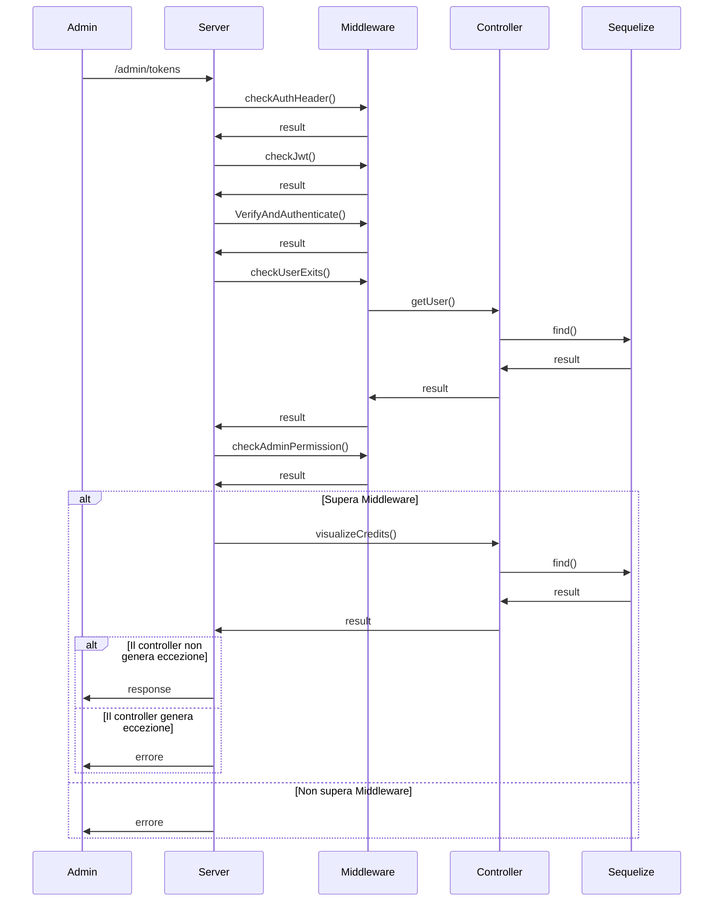

### Put admin/recharge-tokens
La rotta prende in input, come _query parameters_: _email_ e _tokens_to_charge_ da aggiungere all'utente. I controlli effettuati nel _Middleware_ sono i seguenti:

- **Controllo su presenza di _AuthenticationHeader_**: In caso di errore lancia opportuna eccezione: _AuthHeaderError_.
- **Controllo su presenza del _Jwt_**: In caso di errore lancia opportuna eccezione: _NoJwtInTheHeaderError_.
- **Controllo su autenticità del _Jwt_**: In caso di errore lancia opportuna eccezione: _VerifyAndAuthenticateError_.
- **Controllo utente esistente nel Database**: In caso di errore lancia opportuna eccezione: _UserDoesNotExist_.
- **Controllo permessi admin**: In caso di errore lancia opportuna eccezione: _UserNotAdmin_.
- **Controllo validità input**: Viene verificato che i campi siano solamente due e che corrispondano a: '_email_' E '_tokens_to_charge_'. Inoltre viene verificato che il campo email sia effettivamente popolato da un'email(lunghezza massima di 50 caratteri) e che i tokens da aggiungere sia un numero intero positivo strettamente maggiore di 0. In caso di errore, viene lanciata l'eccezione: _IncorrectInputError_.
- **Controllo esistenza utente da ricaricare**: In caso di errore, viene sollevata un'opportuna eccezione: _UserDoesNotExist_.

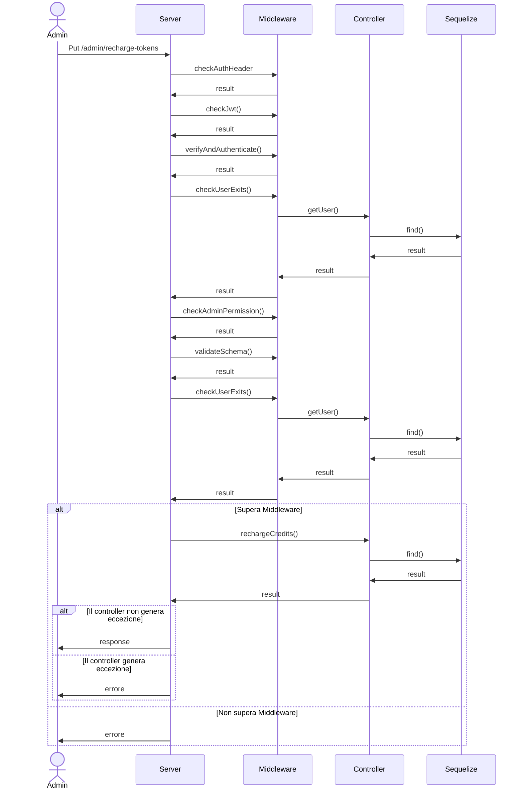

### Get admin/dataset
La rotta, non prende in input alcun parametro e ritorna in output tutti i dataset posseduti da tutti gli utenti del database. I controlli effettuati nel middleware sono i seguenti:

- **Controllo su presenza di _AuthenticationHeader_**: In caso di errore lancia opportuna eccezione: _AuthHeaderError_.
- **Controllo su presenza del _Jwt_**: In caso di errore lancia opportuna eccezione: _NoJwtInTheHeaderError_.
- **Controllo su autenticità del _Jwt_**: In caso di errore lancia opportuna eccezione: _VerifyAndAuthenticateError_.
- **Controllo utente esistente nel Database**: Verifica che l'utente che ha effettuato la richiesta sia presente nel database. In caso di errore viene lanciata un'opportuna eccezione: _UserDoesNotExist_.
- **Controllo su tokens residui**: Verifica che l'utente che vuole effettuare la richiesta abbia un numero di tokens maggiore di 0(zero). In caso di errore, viene sollevata la seguente eccezione: _ZeroTokensError_.
- **Controllo permessi admin**: In caso di errore lancia opportuna eccezione: _UserNotAdmin_.

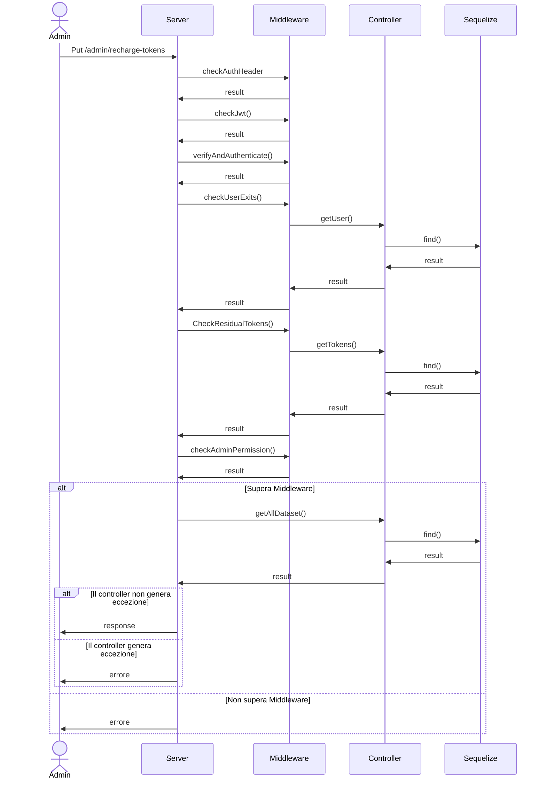

### Get admin/users
La rotta, non prende alcun parametro in input e ritorna in output la lista di tutti e soli gli utenti presenti nel database. Nel middleware vengono effettuati i seguenti controlli:

- **Controllo su presenza di _AuthenticationHeader_**: In caso di errore lancia opportuna eccezione: _AuthHeaderError_.
- **Controllo su presenza del _Jwt_**: In caso di errore lancia opportuna eccezione: _NoJwtInTheHeaderError_.
- **Controllo su autenticità del _Jwt_**: In caso di errore lancia opportuna eccezione: _VerifyAndAuthenticateError_.
- **Controllo utente esistente nel Database**: Verifica che l'utente che ha effettuato la richiesta sia presente nel database. In caso di errore viene lanciata un'opportuna eccezione: _UserDoesNotExist_.
- **Controllo su tokens residui**: Verifica che l'utente che vuole effettuare la richiesta abbia un numero di tokens maggiore di 0(zero). In caso di errore, viene sollevata la seguente eccezione: _ZeroTokensError_.
- **Controllo permessi admin**: In caso di errore lancia opportuna eccezione: _UserNotAdmin_.

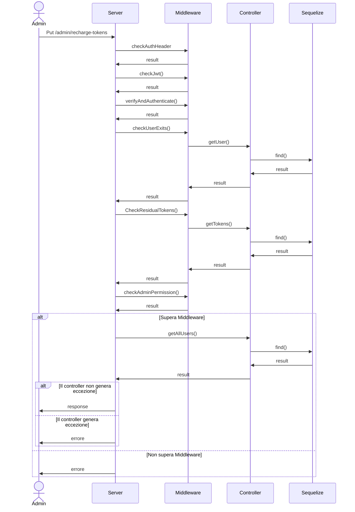

### Post admin/create-user
La rotta aggiunge un nuovo utente al database. Essa, prende in input nel _body_ della richiesta, i seguenti parametri:

- **name**. 
- **surname**.
- **email**.
- **tokens**: Crediti residui iniziali.
- **type**: Tipologia di utente distinguibile tra '_USER_' o '_ADMIN_'.


I controlli effettuati nel middleware sono:

- **Controllo su presenza di _AuthenticationHeader_**: In caso di errore lancia opportuna eccezione: _AuthHeaderError_.
- **Controllo sulla presenza del payload header**: In caso di errore genera l'eccezione: _PayloadHeaderError_.
- **Controllo su presenza del _Jwt_**: In caso di errore lancia opportuna eccezione: _NoJwtInTheHeaderError_.
- **Controllo su autenticità del _Jwt_**: In caso di errore lancia opportuna eccezione: _VerifyAndAuthenticateError_.
- **Controllo utente esistente nel Database**: Verifica che l'utente che ha effettuato la richiesta sia presente nel database. In caso di errore viene lanciata un'opportuna eccezione: _UserDoesNotExist_.
- **Controllo su tokens residui**: Verifica che l'utente che vuole effettuare la richiesta abbia un numero di tokens maggiore di 0 (zero). In caso di errore, viene sollevata la seguente eccezione: _ZeroTokensError_.
- **Controllo permessi admin**: In caso di errore lancia opportuna eccezione: _UserNotAdmin_.
- **Controllo validazione input**: Per ciascun campo vengono effettuate le seguenti verifiche:
  - _name_: Il nome deve essere una stringa di massimo 50 caratteri.
  - _surname_: Il cognome deve essere una stringa di massimo 50 caratteri.
  - _email_: Deve contenere effettivamente una stringa rappresentante un'email e non deve essere più lunga di 50 caratteri.
  - _type_: La tipologia deve essere _USER_ oppure _ADMIN_.
  - _residual_tokens_: Deve essere un numero intero strettamente maggiore di 0.
  
  Se anche solo uno di questi campi dovesse risultare errato o non presente, verrebbe generata la seguente eccezione: _IncorrectInputError_.
- **Controllo non sovrapposizione utenti**: Viene verificato che l'utente aggiunto non abbia la stessa email di uno degli utenti nel database, se così non fosse, verrebbe lanciato l'errore: _UserAlreadyExists_.


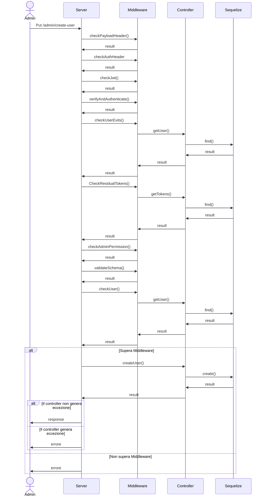

### PUT dataset/insert-videos
La rotta modifica lo stato della tupla della tabella _Dataset_ in Postgress aggiungendo nuovi video. La rotta prende come _query parameters_  il '_dataset_name_' overo il nome del dataset dentro il quale si vuole aggiungere nuovi filmati e nel _body_ della richiesta, prende in input l'array di nuovi video: '_videos_', che dovranno confluire nel dataset.

I controlli che vengono effettuati nel middleware sono i seguenti:

- **Controllo su presenza di _AuthenticationHeader_**: In caso di errore lancia opportuna eccezione: _AuthHeaderError_.
- **Controllo sulla presenza del payload header**: In caso di errore genera l'eccezione: _PayloadHeaderError_.
- **Controllo su presenza del _Jwt_**: In caso di errore lancia opportuna eccezione: _NoJwtInTheHeaderError_.
- **Controllo su autenticità del _Jwt_**: In caso di errore lancia opportuna eccezione: _VerifyAndAuthenticateError_.
- **Controllo utente esistente nel Database**: Verifica che l'utente che ha effettuato la richiesta sia presente nel database. In caso di errore viene lanciata un'opportuna eccezione: _UserDoesNotExist_.
- **Controllo su tokens residui**: Verifica che l'utente che vuole effettuare la richiesta abbia un numero di tokens maggiore di 0 (zero). In caso di errore, viene sollevata la seguente eccezione: _ZeroTokensError_.
- **Controllo validazione input**: Viene verificato che:
  - _dataset_name_: Deve essere presente come parametro obbligatorio sotto forma di stringa e non più lungo di 50 caratteri.
  - _videos_: Deve essere un array di stringhe, obbligatoriamente contenuto nel body della richiesta sotto forma di Json. L'array deve contenere almeno un video.
  In caso di non ottemperanza, verrebbe generata un'apposita eccezione: _IncorrectInputError_.

- **Controllo dataset esistente**: Viene verificato che il dataset, inserito nella query della richiesta, esista realmente ed appartenga all'utente che effettua la richiesta. In caso contrario, viene lanciato la seguente eccezione: _DatasetNotExitsError_.
- **Controllo non ripetizione dei video**: Viene verificato che nell'array dei video da inserire non siano presenti doppioni, in caso contrario viene generata l'eccezione: _VideosAlreadyExitArrayError_ . Inoltre, viene verificata la non presenza di doppioni tra i nuovi video da aggiungere e quelli già presenti nella corrispondente tupla della tabella: _dataset_, in caso contrario viene generata l'eccezione: _VideosAlreadyExitError_.
- **Controllo tokens per caricamento video**:  Viene verificato che i tokens dell'utente che intende effettuare la richiesta siano sufficienti per caricare tutti i video nella tupla della tabella _dataset_. In caso contrario, viene generata l'eccezione: _NotEnoughTokens_.


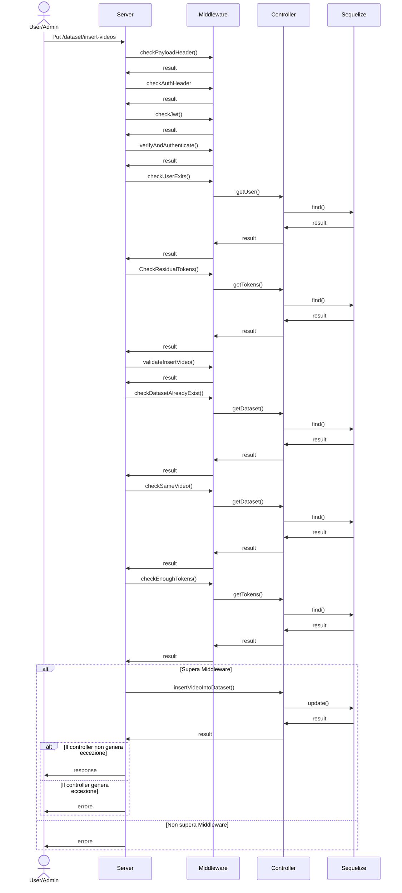

### Get tokens
La rotta, consente di visualizzare il numero di tokens residui del utente chiamante. I controlli effettuati nel middleware sono:

- **Controllo presenza di _AuthenticationHeader_**: In caso di errore lancia opportuna eccezione: _AuthHeaderError_.
- **Controllo su presenza del _Jwt_**: In caso di errore lancia opportuna eccezione: _NoJwtInTheHeaderError_.
- **Controllo su autenticità del _Jwt_**: In caso di errore lancia opportuna eccezione: _VerifyAndAuthenticateError_.
- **Controllo utente esistente nel Database**: Verifica che l'utente che ha effettuato la richiesta sia presente nel database. In caso di errore viene lanciata un'opportuna eccezione: _UserDoesNotExist_.
- **Controllo su tokens residui**: Verifica che l'utente che vuole effettuare la richiesta abbia un numero di tokens maggiore di 0 (zero). In caso di errore, viene sollevata la seguente eccezione: _ZeroTokensError_.
- **Controllo dataset esistente**: Viene verificato che il dataset, inserito nella query della richiesta, esista realmente ed appartenga all'utente che effettua la richiesta. In caso contrario, viene lanciato la seguente eccezione: _DatasetNotExitsError_.
- **Controllo numero di video**: Verifica che il dataset, non sia vuoto e che quindi contenga almeno un video. In caso contrario, viene generata l'eccezione: _NoVideoError_.
- **Controllo disponibilità token per inferenza**: Verifica che i token dell'utente che effettua la richiesta siano sufficiente per processare l'intero dataset. In caso affermativo, i token vengono scalati, mentre in caso negativo viene generata l'eccezione: _NoTokensForInferenceError_.


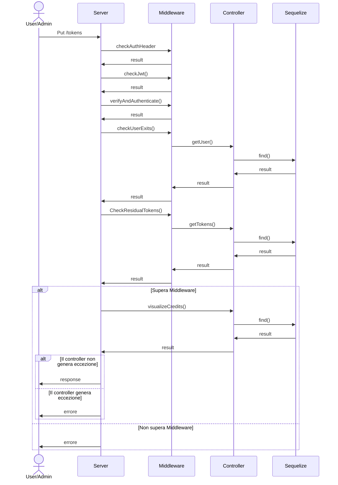

### Put modify-dataset
La rotta prende in input, come _query parameters_, il nome del dataset da modificare: _dataset_name_ ed il nuovo nome: _new_dataset_name_ , effettuando la modifica.

- **Controllo presenza di _AuthenticationHeader_**: In caso di errore lancia opportuna eccezione: _AuthHeaderError_.
- **Controllo su presenza del _Jwt_**: In caso di errore lancia opportuna eccezione: _NoJwtInTheHeaderError_.
- **Controllo su autenticità del _Jwt_**: In caso di errore lancia opportuna eccezione: _VerifyAndAuthenticateError_.
- **Controllo utente esistente nel Database**: Verifica che l'utente che ha effettuato la richiesta sia presente nel database. In caso di errore viene lanciata un'opportuna eccezione: _UserDoesNotExist_.
- **Controllo su tokens residui**: Verifica che l'utente che vuole effettuare la richiesta abbia un numero di tokens maggiore di 0 (zero). In caso di errore, viene sollevata la seguente eccezione: _ZeroTokensError_.
- **Controllo validazione input**: Viene verificato che i paramteri _dataset_name_ e _new_dataset_name_ presenti nella query della richiesta siano stringhe di non più di 50 caratteri ciascuna. Se anche solo uno dei due parametri dovesse essere omesso e/o errato(ad esempio digitando _n_dataset_name_ anzichè _new_dataset_name_), oppure venissero meno le condizioni di lunghezza delle stringhe, allora verrebbe generata l'eccezione: _IncorrectInputError_.


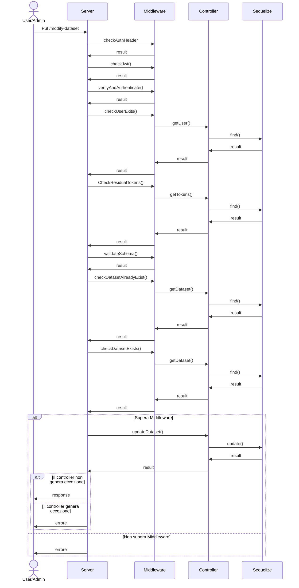

### Post inference
La rotta, prende in input il nome del modello da utilizzare: '_model_name_' ed il nome del dataset: '_dataset_name_' nella query della richiesta. Inserisce il processo in coda e ritorna in output l'id del processo. I controlli middleware effettuati sono: 

- **Controllo presenza di _AuthenticationHeader_**: In caso di errore lancia opportuna eccezione: _AuthHeaderError_.
- **Controllo su presenza del _Jwt_**: In caso di errore lancia opportuna eccezione: _NoJwtInTheHeaderError_.
- **Controllo su autenticità del _Jwt_**: In caso di errore lancia opportuna eccezione: _VerifyAndAuthenticateError_.
- **Controllo utente esistente nel Database**: Verifica che l'utente che ha effettuato la richiesta sia presente nel database. In caso di errore viene lanciata un'opportuna eccezione: _UserDoesNotExist_.
- **Controllo su tokens residui**: Verifica che l'utente che vuole effettuare la richiesta abbia un numero di tokens maggiore di 0 (zero). In caso di errore, viene sollevata la seguente eccezione: _ZeroTokensError_.
- **Controllo validazione input**: Verifica che i campi _dataset_name_ e _model_ siano presenti e contengano stringhe. Inoltre verifica che _model_ sia popolato solo con due diversi tipi di modelli: '_model.tflite_' oppure '_model_8bit.tflite_'. In caso di errore viene generata l'eccezione: _IncorrectInputError_.


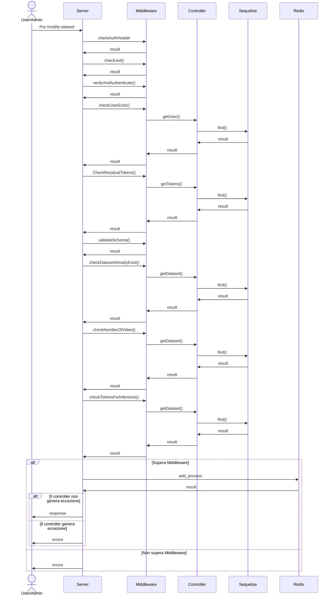

### Get result
La rotta, prende come input nella query della richiesta, l'_id_ corrispondente al processo di inferenza effettuato dall'utente e di cui si vuole conoscere il risultato. Il middleware implementato per la richiesta è il seguente:

- **Controllo presenza di _AuthenticationHeader_**: In caso di errore lancia opportuna eccezione: _AuthHeaderError_.
- **Controllo su presenza del _Jwt_**: In caso di errore lancia opportuna eccezione: _NoJwtInTheHeaderError_.
- **Controllo su autenticità del _Jwt_**: In caso di errore lancia opportuna eccezione: _VerifyAndAuthenticateError_.
- **Controllo utente esistente nel Database**: Verifica che l'utente che ha effettuato la richiesta sia presente nel database. In caso di errore viene lanciata un'opportuna eccezione: _UserDoesNotExist_.
- **Controllo su tokens residui**: Verifica che l'utente che vuole effettuare la richiesta abbia un numero di tokens maggiore di 0 (zero). In caso di errore, viene sollevata la seguente eccezione: _ZeroTokensError_.
- **Controllo validazione input**: Viene verificato che l'_id_ immesso sia un intero positivo strettamente maggiore di 0(zero).

Il controller _getResult()_ inoltre, ha lo scopo di filtrare l'_id_ immesso nella richiesta, facendo visualizzare il processo solo se completo e se l'utente che ha lanciato il processo di inferenza è lo stesso che cerca di scaricare i risultati.

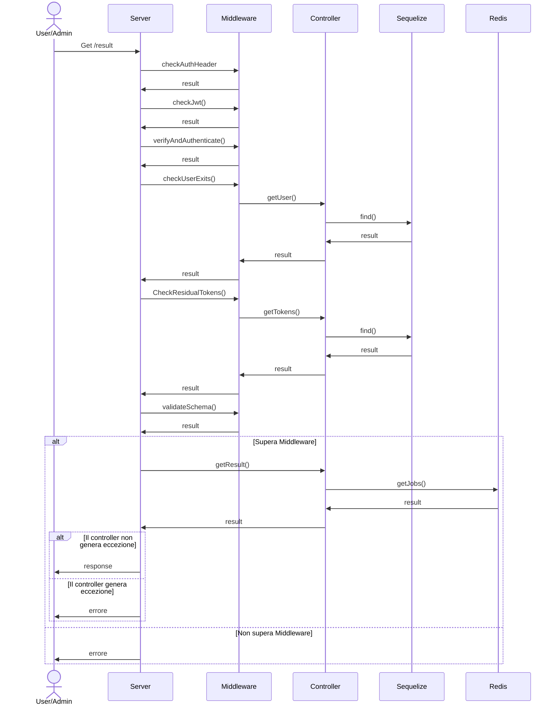

### Get user-jobs
La seguente rotta, mostra tutti e soli i risultati dei jobs di inferenza riferiti all'utente che ha effettuato la chiamata _/user-jobs_. In caso di processo ' _completed_', Dovrà anche essere stampato il risultato, mentre in caso di '_failed_' dovrà essere mostrato a schermo il codice e messaggio di errore. Ulteriori stati osservabili dalla rotta, oltre ai due precedentemente menzionati, sono:
- 'Active': Il processo è in fase di inferenza.
- 'Wait': Il processo è in attesa di iniziare l'inferenza.

I controlli middleware implementati sono i seguenti:

- **Controllo presenza di _AuthenticationHeader_**: In caso di errore lancia opportuna eccezione: _AuthHeaderError_.
- **Controllo su presenza del _Jwt_**: In caso di errore lancia opportuna eccezione: _NoJwtInTheHeaderError_.
- **Controllo su autenticità del _Jwt_**: In caso di errore lancia opportuna eccezione: _VerifyAndAuthenticateError_.
- **Controllo utente esistente nel Database**: Verifica che l'utente che ha effettuato la richiesta sia presente nel database. In caso di errore viene lanciata un'opportuna eccezione: _UserDoesNotExist_.
- **Controllo su tokens residui**: Verifica che l'utente che vuole effettuare la richiesta abbia un numero di tokens maggiore di 0 (zero). In caso di errore, viene sollevata la seguente eccezione: _ZeroTokensError_.

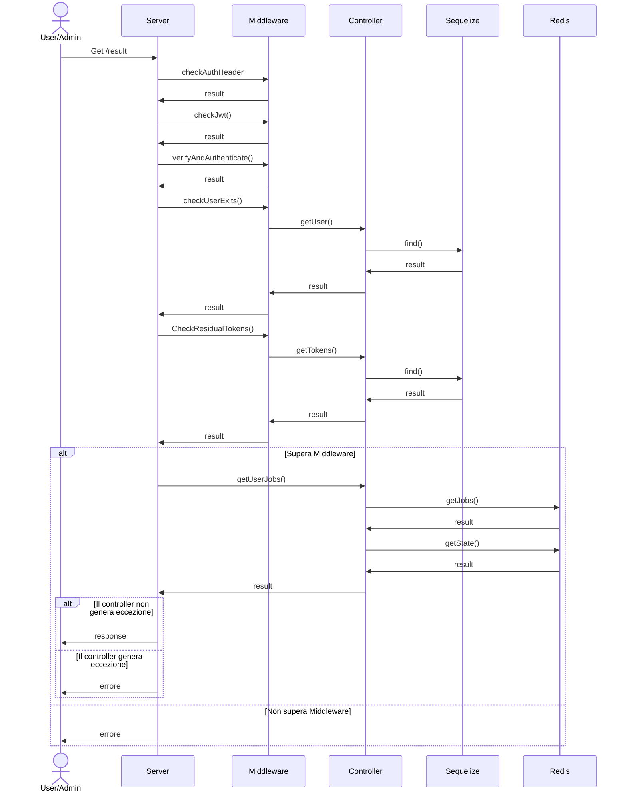

### Get /generate-jwt
La rotta restituisce un token Jwt, con algoritmo di firma: '_HS256_'. La chiave segreta per firmare il _JWT_ è presente nel file _.env_, non disponibile nella repository. Per funzionaere correttamente, dovranno essere inseriti nei _query parameters_ i seguenti:

- **email**: Email dell'utente.
- **type**: Tipo di utente: user o admin.
- **expiration**: Tempo di validità del token dal momento in cui viene generato. Si tenga presente che tale tempo, per comodità, è espresso in giorni.

  E' stato implementato un controllo middleware sulla correttezza dei dati di input:

  - **email**: Deve essere un email valida e lunga non più di 50 caratteri.
  - **type**: Il tipo deve essere una stringa popolata solo da due possibili valori: '_USER_' oppure '_ADMIN_'.
  - **expiration**: Deve essere un numero intero positivo compreso tra 1 e 48.

  Nel caso in cui, anche solo uno dei tre(3) parametri elencati dovesse essere non presente o scorretto, verrebbe generato l'errore: _IncorrectInputError_.


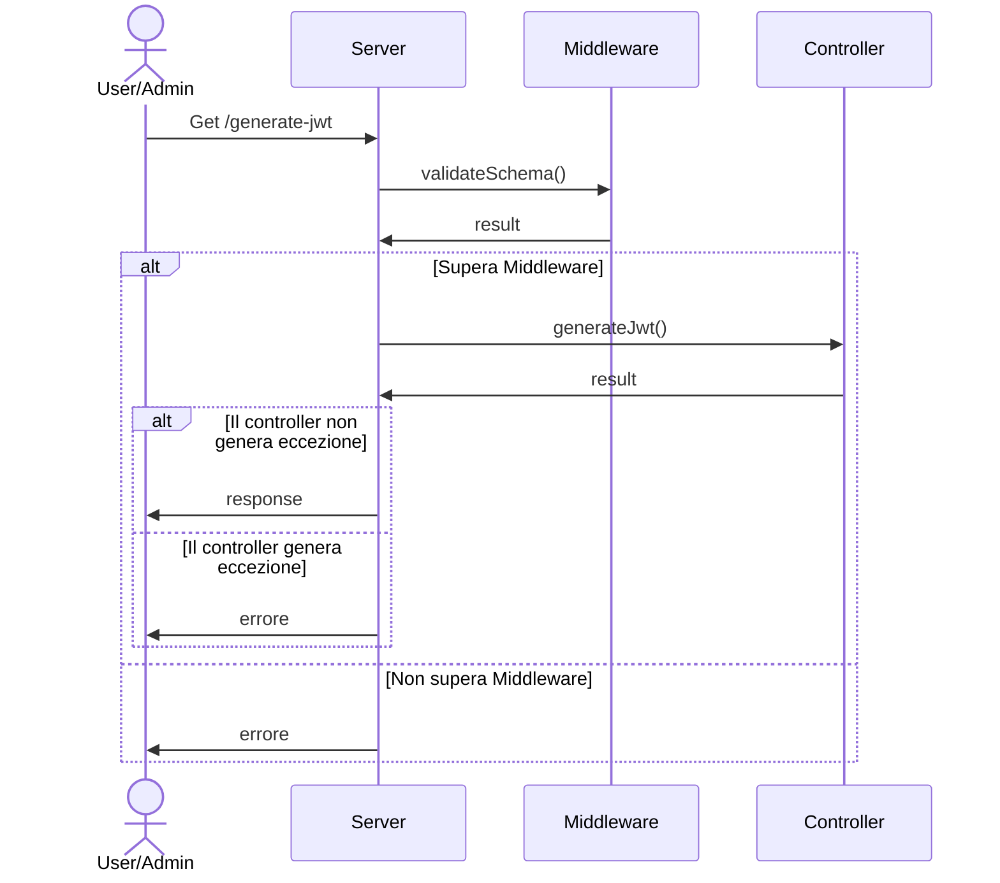


## API Docs

### Admin

#### Get Tokens 🔐
Routes:
```
GET /admin/tokens
```
Request:
```
Authorization: Bearer {token}
```
Response: 
```json
{
"successo": true,
    "data": [
        {
            "email": "mariorossi@gmail.com",
            "residual_tokens": 2000
        },
        {
            "email": "francor@gmail.com",
            "residual_tokens": 150
        }
    ]
}
```

#### Recharge Tokens 🔐
```
PUT /admin/recharge-tokens
```
Request:
```
Authorization: Bearer {token}
```
```params
email = mariorossi@gmail.com
tokens_to_charge = 200
```
Response: 
```json
    {
    "successo": true,
    "data": "Credito correttamente aggiornato."
    }
```

#### Get all Datasets 🔐
```
GET /admin/dataset
```
Request:
```
Authorization: Bearer {token}
```
Response: 
```json
{
    "successo": true,
    "data": [
        {
            "id": 1,
            "dataset_name": "prova",
            "videos": ["1.mp4", "2.mp4", "3.mp4"],
            "email": "mariorossi@gmail.com",
            "createdAt": "2024-07-14T17:24:05.700Z",
            "updatedAt": "2024-07-14T17:24:05.700Z"
        },
        {
            "id": 2,
            "dataset_name": "test",
            "videos": ["4.mp4", "5.mp4", "6.mp4"],
            "email": "francor@gmail.com",
            "createdAt": "2024-07-14T17:24:05.700Z",
            "updatedAt": "2024-07-14T17:24:05.700Z"
        }
    ]
}
```

#### Get all users 🔐
```
GET /admin/users
```
Request:
```
Authorization: Bearer {token}
```
Response: 
```json
{
    "successo": true,
    "data": [
        {
            "user_id": 1,
            "name": "Mario",
            "surname": "Rossi",
            "email": "mariorossi@gmail.com",
            "residual_tokens": 200
        },
        {
            "user_id": 2,
            "name": "Franco",
            "surname": "Verdi",
            "email": "francor@gmail.com",
            "residual_tokens": 150
        }
    ]
}
```

#### Create user 🔐
```
POST /admin/create-user
```
Request:
```
Authorization: Bearer {token}
```
```json
{
    "name": "Agnese",
    "surname": "Bruglia",
    "email": "agnese.b@gmail.com",
    "type": "ADMIN",
    "residual_tokens": 500
}
```
Response: 
```json
{
    "user_id": 3,
    "name": "Agnese",
    "surname": "Bruglia",
    "email": "agnese.b@gmail.com",
    "type": "ADMIN",
    "residual_tokens": 500,
    "updatedAt": "2024-07-14T17:36:57.943Z",
    "createdAt": "2024-07-14T17:36:57.943Z"
}
```

### User

#### Create dataset 🔐
```
POST /create-dataset
```
Request:
```
Authorization: Bearer {token}
```
```json
{
    "dataset_name": "prova"
}
```
Response: 
```json
"prova"
```

#### Get dataset 🔐
```
GET /dataset
```
Request:
```
Authorization: Bearer {token}
```
Response: 
```json
{
    "successo": true,
    "data": [
        {
            "dataset_name": "prova",
            "videos": [],
            "email": "mariorossi@gmail.com"
        },
        {
            "dataset_name": "test",
            "videos": [],
            "email": "mariorossi@gmail.com"
        }
    ]
}
```

#### Update dataset 🔐
```
PUT /modify-dataset
```
Request:
```
Authorization: Bearer {token}
```
```params
dataset_name = test
new_dataset_name = prova2
```
Response: 
```json
{
    "successo": true,
    "data": "Modifica del dataset avvenuta correttamente."
}
```

#### Insert videos into dataset 🔐
```
PUT /dataset
```
Request:
```
Authorization: Bearer {token}
```
```params
dataset_name = prova2
```
```json
{
  "new_videos": [
    "1.mp4",
    "2.mp4",
    "3.mp4",
    "10.mp4"
  ]
}
```
Response: 
```json
{
    "successo": true,
    "data": "I video sono stati correttamente inseriti nel dataset"
}
```

#### Delete dataset 🔐
```
DELETE /dataset
```
Request:
```
Authorization: Bearer {token}
```
```params
dataset_name = prova
```
Response: 
```json
{
    "successo": true,
    "data": "Dataset rimosso correttamente dal DB."
}
```

#### Inference 🔐
```
POST /inference
```
Request:
```
Authorization: Bearer {token}
```
```params
dataset_name = prova
model_name = model.tflite
```
Response: 
```json
{
    "job_id": "1"
}
```

#### User jobs 🔐
```
GET /user-jobs
```
Request:
```
Authorization: Bearer {token}
```
Response: 
```json
[
    {
        "process_id": "3",
        "status": "active"
    },
    {
        "process_id": "2",
        "status": "completed",
        "data": {
            "status": 200,
            "message": {
                "/app/dataset_&_modelli/dataset/22.mp4": "Non Violento",
                "/app/dataset_&_modelli/dataset/34.mp4": "Violento",
                "/app/dataset_&_modelli/dataset/50.mp4": "Violento",
                "/app/dataset_&_modelli/dataset/52.mp4": "Non Violento"
            }
        }
    },
    {
        "process_id": "1",
        "status": "completed",
        "data": {
            "status": 200,
            "message": {
                "/app/dataset_&_modelli/dataset/1.mp4": "Non Violento",
                "/app/dataset_&_modelli/dataset/10.mp4": "Non Violento",
                "/app/dataset_&_modelli/dataset/2.mp4": "Non Violento",
                "/app/dataset_&_modelli/dataset/3.mp4": "Violento"
            }
        }
    }
]
```

#### Result 🔐
```
GET /result
```
Request:
```
Authorization: Bearer {token}
```
```params
id = 3
```
Response: 
```json
{
    "successo": true,
    "data": {
        "status": 200,
        "message": {
            "/app/dataset_&_modelli/dataset/11.mp4": "Violento",
            "/app/dataset_&_modelli/dataset/12.mp4": "Violento",
            "/app/dataset_&_modelli/dataset/13.mp4": "Violento",
            "/app/dataset_&_modelli/dataset/14.mp4": "Non Violento"
        }
    }
}
```

#### Get tokens 🔐
```
GET /tokens
```
Request:
```
Authorization: Bearer {token}
```
Response: 
```json
{
    "successo": true,
    "data": 132
}
```


## Startup

Per eseguire il progeto, dopo avere eseguito la `clone` del progetto, in locale procedere nel seguente modo:

1. Aprire la shell nella directory di progetto, ovvero dentro la cartella _/PA2024_.

2. Copiare il file di ambiente e apportare le modifiche, in particolare alle password
**Windows**
```
copy <PERCORSO_FILE_\.env> 
```   
**Linux**
```
cp <PERCORSO_FILE_\.env> 
```
2. Tramite Docker CLI eseguire il seguente comando:
```
docker-compose up -d --build
```
Inoltre, è possibile accedere ai servizi in questa maniera:
- `localhost:3000`: è destinato alle chiamate API e all'interrogazione degli endpoint come descritto nella sezione 'API Docs'
- `localhost:3100`: serve per accedere al servizio di generazione del jwt - rotta POST `\generate-token'
- `localhost:5005`: serve per accedere al servizio per il conteggio del numero di token necessari per fare inferenza su un certo dataset - rotta POST `\cost'
- `localhost:5000`: serve per accedere al servizio python per l'inferenza su un certo dataset con un certo modello - rotta POST `\inference'
- `localhost:6379`: serve per accedere al servizio redis
- `localhost:5432`: serve per accedere al servizio postgress.


## Q & A

1.  Cosa succede se non inserisco il file _.env_ ?
-   Il file '_.env_', contiene passoword per la connessione al db e la firma dei token jwt, il non inserirlo comporterebbe malfunzionamenti del sistema nel suo complesso.

2.  Durante la build del progetto, è stato sollevato un errore a causa del file: '_entrypoint.sh_', come faccio per risolvere?
-   Semplice ! Occorre eseguire i seguenti passaggi in ordine:
    1. Copia il contenuto del file '_entrypoint.sh_'.
    2. Cancella il file '_entrypoint.sh_'.
    3. Nello stesso punto dove il file è stato cancellato, crea un nuovo file chiamato: '_entrypoint.sh_' ed incolla il contenuto precedentemente copiato.


## Autori e Contributi

<table>
  <tr>
    <td><a href="https://github.com/lucabellantee"><strong>Luca Bellante</strong></a></td>
    <td><progress value="50" max="100"></progress> 50%</td>
  </tr>
  <tr>
    <td><a href="https://github.com/AgneseBruglia"><strong>Agnese Bruglia</strong></a></td>
    <td><progress value="50" max="100"></progress> 50%</td>
  </tr>
</table>


